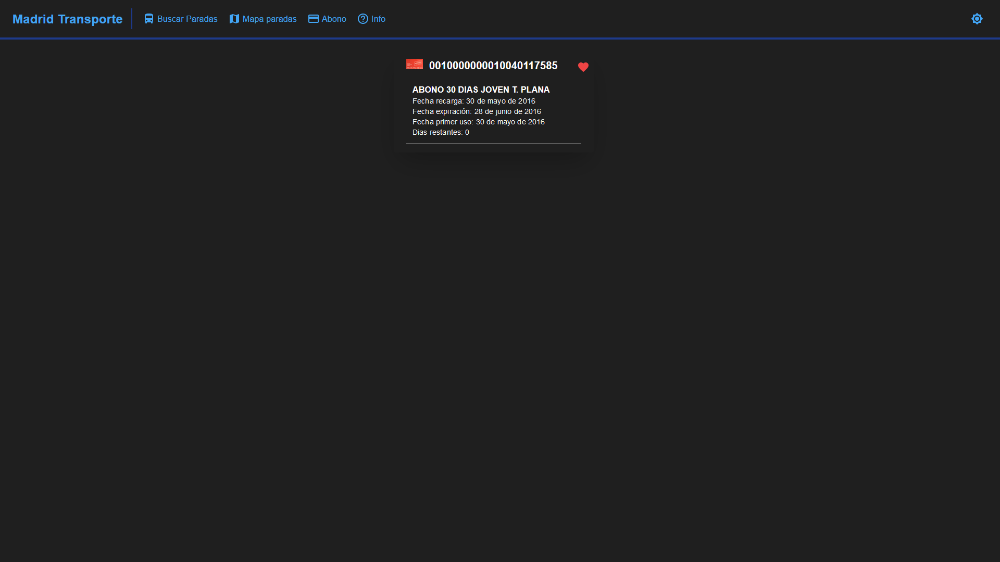

# MadridTransporte
MadridTransporte es una app que te permite ver/notificar los tiempos de las paradas y abonos

## Uso
Para empezar a usar MadridTransporte solo tienes que ir a [madridtransporte.com](madridtransporte.com)

### ¿Como puedo ver los tiempos?
Simplemente introduce el nombre de la parada o su correspondiente codigo en el buscador.

Haz click en la parada que necesites y veras los tiempos de las lineas que pasan por esa parada.

### ¿Como puedo guardar la parada en favoritos?

Simplemente dale al corazon y ponle un nombre.

### ¿Como puedo recibir notificaciones con los tiempos?

Para recibir notificaciones de una linea en una parada solo tienes que ir a la parada y darle al boton de notificaciones.

Cada minuto recibiras una notificacion con los tiempos de la linea que has seleccionado.

Puedes cancelar las notificaciones en cualquier momento dandole al boton de otra vez desde la parada o la pagina principal.

### ¿Como puedo buscar una parada en el mapa?

Para buscar una parada en el mapa solo tienes que darle al boton de mapa.

### ¿Como puedo ver la informacion de mi abono?

Para ver la informacion de tu abono solo tienes que darle al boton de abono.

### ¿Como puedo saber si una hay alguna incidencia?

Para ver si hay incidencias, solo tienes que ir a la parada que vayas a usar y (si hay incidencias) te aparecera un boton de avisos.

Si la parada se ve afectada directamente en alguna de sus lineas, te aparecera un icono al lado del boton de favoritos.

