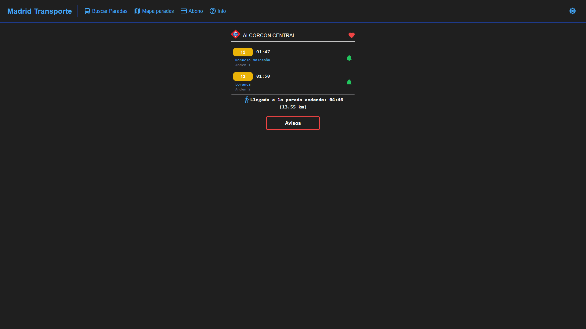
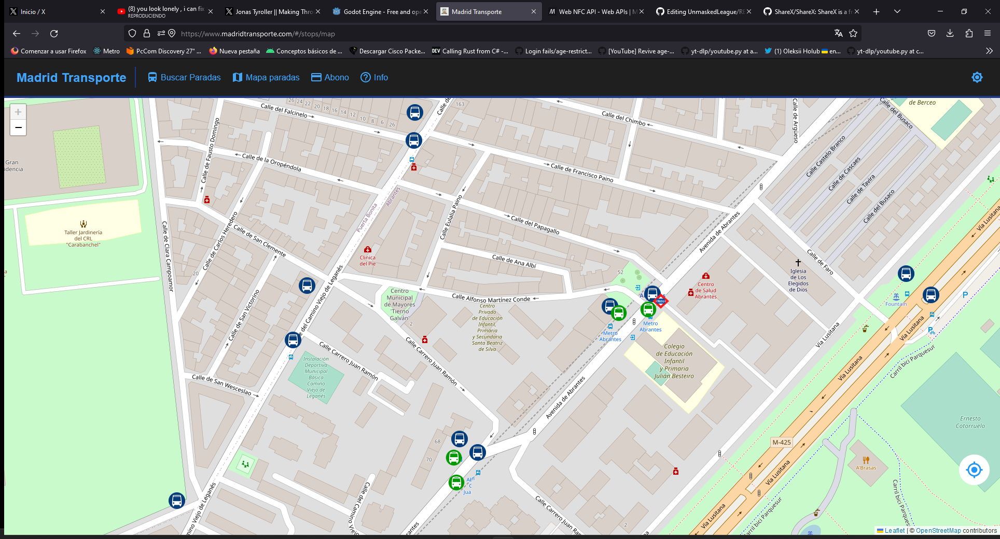

# MadridTransporte

> [!NOTE]\
> Puedes leer mas sobre como funciona aqui: [¿Como funcionan los sistemas del transporte publico?](https://web-xbaank.vercel.app/blog/How-public-transport-systems-work)

MadridTransporte es una app que te permite ver los tiempos de las paradas de EMT Madrid, Metro de Madrid, Cercanias Renfe Madrid y Autobuses urbanos e interurbanos de la Comunidad de Madrid.

## Instalacion
No necesitas instalar nada, solo tienes que ir a [MadridTransporte.com](https://madridtransporte.com)

> [!IMPORTANT]\
> Aunque si estas en movil, puedes instalarla como una app, simplemente dandole al boton de añadir a pantalla de inicio en cualquier navegador.
> 
> Esto te permitira cargar la app mas rapido y tenerla en tu pantalla de inicio.
> 
> Tambien puedes descargar el apk desde [Aqui](https://github.com/xBaank/MadridTransporte-front/releases)

## Ventajas
- No necesitas instalar nada
- Es gratis (**SIN ANUNCIOS**)
- Es completamente **open source**
- Totalmente multiplataforma (solo necesitas un navegador)
- Ver la hora de llegada de los autobuses en vez de el tiempo restante
- Recibir notificaciones con los tiempos de las lineas que quieras

## Permisos
- `Ubicacion`: Para poder mostrar las paradas cercanas.
- `Notificaciones`: Para poder enviarte notificaciones con los tiempos de las lineas.

# FAQ
- [¿Como puedo ver los tiempos?](#Como-puedo-ver-los-tiempos)
- [¿Como puedo guardar la parada en favoritos?](#Como-puedo-guardar-la-parada-en-favoritos)
- [¿Como puedo recibir notificaciones con los tiempos?](#Como-puedo-recibir-notificaciones-con-los-tiempos)
- [¿Como puedo buscar una parada en el mapa?](#Como-puedo-buscar-una-parada-en-el-mapa)
- [¿Como puedo ver la informacion de mi abono?](#Como-puedo-ver-la-informacion-de-mi-abono)
- [¿Como puedo saber si una hay alguna incidencia?](#Como-puedo-saber-si-una-hay-alguna-incidencia)

## ¿Como puedo ver los tiempos?
Simplemente introduce el nombre de la parada o su correspondiente codigo en el buscador.

Haz click en la parada que necesites y veras los tiempos de las lineas que pasan por esa parada.

## ¿Como puedo guardar la parada en favoritos?

Simplemente dale al corazon y ponle un nombre.

## ¿Como puedo recibir notificaciones con los tiempos?

Para recibir notificaciones de una linea en una parada solo tienes que ir a la parada y darle al boton de notificaciones.

Cada minuto recibiras una notificacion con los tiempos de la linea que has seleccionado (Si se pueden obtener los tiempos).

Puedes cancelar las notificaciones en cualquier momento dandole al boton de otra vez desde la parada o la pagina principal.

## ¿Como puedo buscar una parada en el mapa?

Para buscar una parada en el mapa solo tienes que darle al boton de mapa.

## ¿Como puedo ver la informacion de mi abono?

Para ver la informacion de tu abono solo tienes que darle al boton de abono.

## ¿Como puedo saber si una hay alguna incidencia?

Para ver si hay incidencias, solo tienes que ir a la parada que vayas a usar y (si hay incidencias) te aparecera un boton de avisos.

Si la parada se ve afectada directamente en alguna de sus lineas, te aparecera un icono al lado del boton de favoritos.

